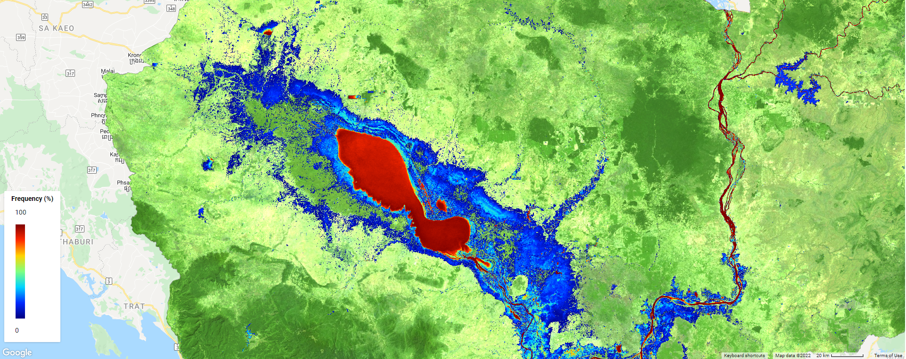

Mapping flood frequency in Cambodia from 1988 to 2020 using Google Earth Engine
==========================================================================================

--------------------

**Overview**

In this project, I try to develop a Google Earth Engine App that help us quickly visualize the flood frequency map of Cambodia from 1988 to 2020 using the dataset from JRC. The Joint Research Centre (JRC) Monthly Water History dataset contains maps of the location and temporal distribution of surface water from 1984 to 2020 at 30-metre resolution and provides statistics on the extent and change of those water surfaces; however, the data covering Cambodia is avalaible only from 1988.

.. toctree::
   :maxdepth: 2
   :caption: The script for earth engine app development is avalaible here::

   cambodia-flood-frequency/1-flood-frequency-mapping.rst

**Earth Engine Apps**

`Open in full screen <https://vuthy.users.earthengine.app/view/cambodia-flood-frequency-map>`__

.. raw:: html

    <iframe width=100% height="600px" src="https://vuthy.users.earthengine.app/view/cambodia-flood-frequency-map" title="Flood Frequency Map - Cambodia" frameborder="1" allowfullscreen></iframe>

