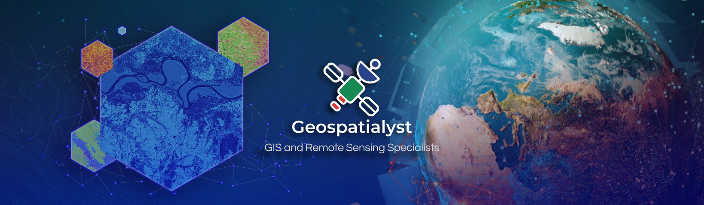
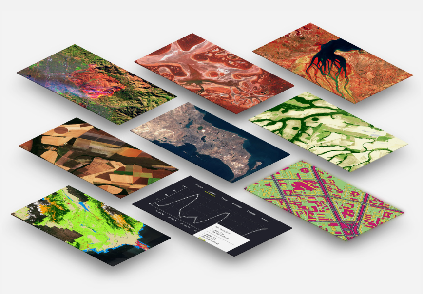

**Welcome to our documentation**
=====================================================

----------------

   
About us
----------------

   
Geospatialyst is a GIS and remote sensing specialist team with the mission of providing solutions to all technical issues in geographic information and geospatial data analysis for atmospheric, ocean, and land studies at various spatial and temporal scales. Besides seeking technical solution, our main goal is also to share the knowledge, information, opportunity in this field and help people getting started with their journey for doing geo data analysis more efficiently through this documentation website and our facebook page. 

--------------------

.. _consectetur: https://www.facebook.com/GeospatialystCambodia
.. |consectetur| replace:: **Geospatialyst - Cambodia** 

|consectetur|_

--------------------

This website contains three main sections: Projects, Documentations, and Lessons.

.. admonition:: Projects
   
   This section describes the technical solution to solve various topics including land cover classification, flood water surface extraction, forest cover, etc. 

.. admonition:: Documentations

   This section describes the programming technics in different applications including LiDAR, geo-python, Google Earth Engine, machine learning and deep learning. 

.. admonition:: Lessons

   This section provides full lessons to understand the basic concepts of programming and scientific data analysis using Python programming language. 

Contents
----------------

.. toctree::
   :maxdepth: 2
   :caption: Projects

   Content/Project/2020
   Content/Project/2021
   Content/Project/2022

.. toctree::
   :maxdepth: 2
   :caption: Documentations

   Content/Documentation/lidar
   Content/Documentation/geo-python
   Content/Documentation/google-earth-engine
   Content/Documentation/machine-learning
   Content/Documentation/deep-learning

.. toctree::
   :maxdepth: 2
   :caption: Lessons

   Content/Lesson/geo-python-course

.. admonition:: Contact Info

   - Email: geospatialyst@gmail.com
   - Facebook page: `@GeospatialystCambodia <https://www.facebook.com/GeospatialystCambodia>`__

